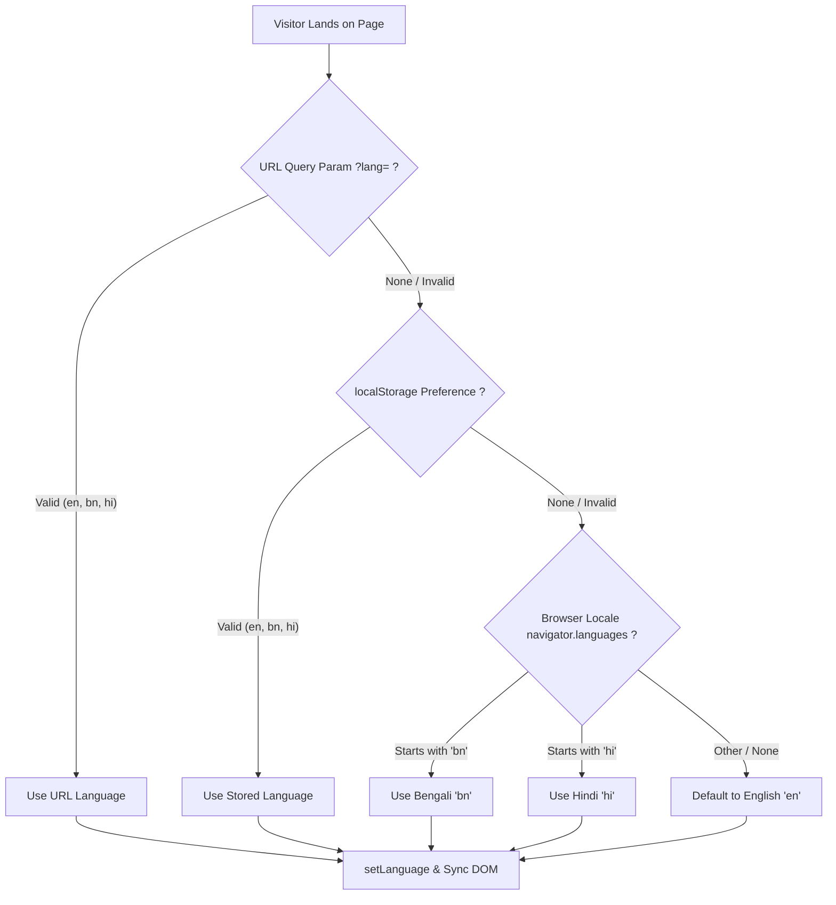

# XESTUS Internationalization (i18n) Architecture

## 1. Executive Summary

XESTUS features a client-side, zero-dependency internationalization (i18n) architecture designed specifically for static hosting (GitHub Pages) and edge CDNs. The system delivers multi-language switching across **English (`en`)**, **Bengali (`bn` / বাংলা)**, and **Hindi (`hi` / हिन्दी)** with zero layout shift (CLS 0.00), zero server round-trips, and zero exposure of raw key tokens.

---

## 2. Supported Languages

| Code | Language | Native Name | Default / Status |
| :--- | :--- | :--- | :--- |
| `en` | English | English | Canonical Default (`x-default`) |
| `bn` | Bengali | বাংলা | Production Ready (215 Keys) |
| `hi` | Hindi | हिन्दी | Production Ready (215 Keys) |

> **Design Note on Technical Nomenclature**:  
> To protect industry recognition and avoid awkward machine translations, core brand names and standard technical terminology (*XESTUS*, *FastAPI*, *Python*, *Docker*, *MCP*, *LangGraph*, *RAG*, *AutoCAD*, *PostgreSQL*, *Node.js*, *API*, *IoT*) remain in their standard Latin formats across all translations while surrounding descriptions, labels, badges, and CTAs are translated into native phrasing.

---

## 3. Core Architecture & File Structure

```text
├── index.html                  # SEO hreflang tags, data-i18n attributes, UI switchers
├── js/
│   └── translations.js         # Preloaded dictionary (en, bn, hi) with 215 keys each
├── script.js                   # Detection controller, fallback resolver, DOM translator
├── docs/
│   ├── INTERNATIONALIZATION.md # Complete system documentation (this file)
│   └── ARCHITECTURE.md         # Overall system architecture
```

### Preloading Strategy
`js/translations.js` is loaded synchronously in the `<head>` of `index.html` immediately after critical CSS and configuration:
```html
<script src="js/translations.js"></script>
```
Because the translation data is preloaded before DOM rendering completes, translations can be applied during initial paint without visual flash or layout shift.

---

## 4. Multi-Layer Detection Priority

When a visitor lands on XESTUS, the system determines the initial language using a 4-tier waterfall:



1. **URL Parameter (`?lang=bn` / `?lang=hi`)**: Highest priority. Allows direct language sharing and deep-linking from campaigns or search engines.
2. **User Preference (`localStorage.getItem('xestus_user_language')`)**: Remembers user selection across sessions.
3. **Browser Locale (`navigator.languages`)**: Automatically detects users with Bengali or Hindi browser/system settings.
4. **Canonical Fallback (`en`)**: Ensures 100% reliable baseline experience.

---

## 5. Zero-Failure Fallback Resolver

Every DOM node translation is guarded by a two-stage fallback:
$$\text{Resolved Value} = \text{dict}[\text{key}] \parallel \text{fallbackDict}[\text{key}] \parallel \text{null}$$

If a key is missing in a target language dictionary:
1. The system automatically retrieves the string from the canonical English dictionary (`translations.en[key]`).
2. If neither exists, the element's existing DOM text is preserved untouched.
3. The user **never** sees raw keys (e.g. `services.s1_title`), `undefined`, or broken placeholders.

---

## 6. HTML Data Attribute API

The DOM translation controller scans for 4 specialized HTML attributes:

| Attribute | Target DOM Property | Example Usage |
| :--- | :--- | :--- |
| `data-i18n` | `element.textContent` | `<h2 data-i18n="services.title">Specialized Engineering</h2>` |
| `data-i18n-placeholder` | `element.placeholder` | `<input data-i18n-placeholder="contact.name_placeholder">` |
| `data-i18n-title` | `element.title` | `<button data-i18n-title="common.copy_email">` |
| `data-i18n-aria-label` | `element.setAttribute('aria-label')` | `<button data-i18n-aria-label="nav.lang_select">` |

---

## 7. Dynamic UI Synchronization

When switching languages, the system updates:
1. **Document Metadata**:
   - `<html lang="en|bn|hi">`
   - `document.title` (e.g. "XESTUS | কৃত্রিম বুদ্ধিমত্তা...")
   - `<meta name="description" content="...">`
2. **URL Address Bar**: Synchronizes `?lang=bn` without triggering a full page reload via `window.history.replaceState`.
3. **Follow Section UI**: Re-evaluates follow button state (`common.follow` vs `common.following` vs `common.followed`).
4. **Live Stats Telemetry**: Re-evaluates telemetry badge and status messages (`stats.syncing`, `stats.unavailable`, `stats.live_badge`).
5. **Lucide Icons**: Re-invokes `lucide.createIcons()` to guarantee zero icon loss during DOM updates.

---

## 8. SEO & International Discoverability

### Canonical & Alternate `hreflang` Tags
`index.html` includes search-engine indexable metadata in `<head>`:
```html
<link rel="alternate" hreflang="x-default" href="https://xestus.in/">
<link rel="alternate" hreflang="en" href="https://xestus.in/?lang=en">
<link rel="alternate" hreflang="bn" href="https://xestus.in/?lang=bn">
<link rel="alternate" hreflang="hi" href="https://xestus.in/?lang=hi">
```

### Sitemap & Robots Verification
- `sitemap.xml` lists the primary URL and alternates.
- `robots.txt` permits crawling across all supported query parameters.

---

## 9. Developer Guide: How to Add New Languages

Adding a new language (e.g., Spanish `es`, German `de`, Japanese `ja`, or Arabic `ar`) is straightforward:

### Step 1: Update Supported Languages in `script.js`
```javascript
const SUPPORTED_LANGS = ["en", "bn", "hi", "es"];
```

### Step 2: Add Dictionary in `js/translations.js`
```javascript
window.XESTUS_TRANSLATIONS = {
  en: { ... },
  bn: { ... },
  hi: { ... },
  es: {
    "meta.title": "XESTUS | Inteligencia Más Allá de los Límites — Software de IA...",
    "meta.description": "XESTUS diseña sistemas autónomos de IA...",
    // Add all 215 keys matching the 'en' dictionary structure
  }
};
```

### Step 3: Add Switcher UI Buttons in `index.html`
**Desktop Dropdown (`#langDropdown`)**:
```html
<button class="lang-opt" data-lang="es" role="menuitem">
    <span class="lang-code">ES</span>
    <span class="lang-native">Español</span>
</button>
```

**Mobile Drawer (`.mobile-lang-strip`)**:
```html
<button class="mobile-lang-btn" data-lang="es">ES</button>
```

### Step 4: Add `hreflang` Tag in `index.html`
```html
<link rel="alternate" hreflang="es" href="https://xestus.in/?lang=es">
```

### Step 5 (Optional - Right-to-Left / RTL):
If adding an RTL language like Arabic (`ar`) or Hebrew (`he`), add direction switching in `setLanguage`:
```javascript
document.documentElement.setAttribute("dir", lang === "ar" || lang === "he" ? "rtl" : "ltr");
```

---

## 10. Verification & Quality Assurance

To verify 100% key parity across all translation dictionaries, run:

```bash
node -e '
const vm = require("vm");
const fs = require("fs");
const code = fs.readFileSync("js/translations.js", "utf8");
const sandbox = { window: {} };
vm.createContext(sandbox);
vm.runInContext(code, sandbox);
const t = sandbox.window.XESTUS_TRANSLATIONS;
const en = Object.keys(t.en);
["bn", "hi"].forEach(l => {
  const missing = en.filter(k => !t[l][k]);
  console.log(`${l} missing keys:`, missing.length === 0 ? "0 (100% Parity)" : missing);
});
'
```
